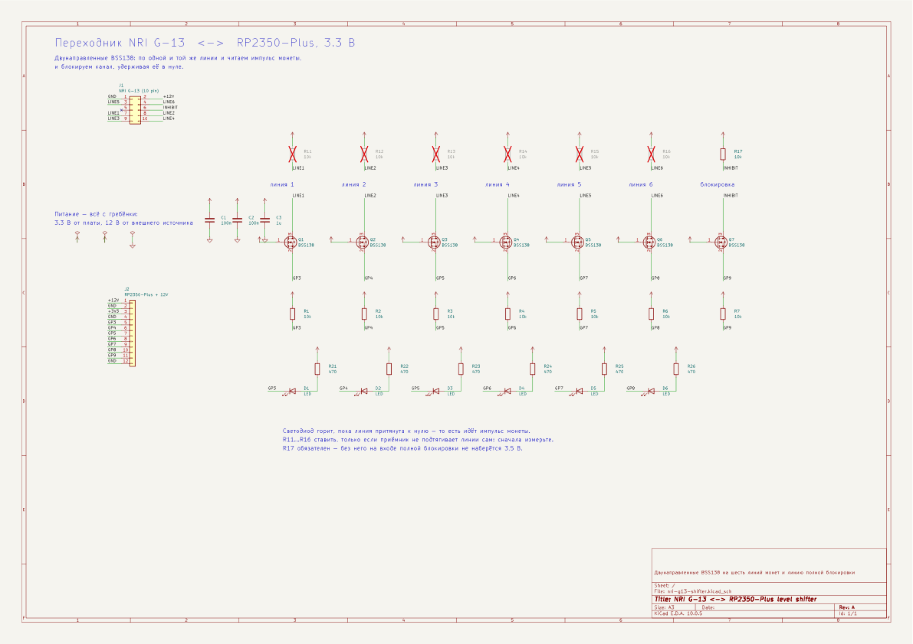
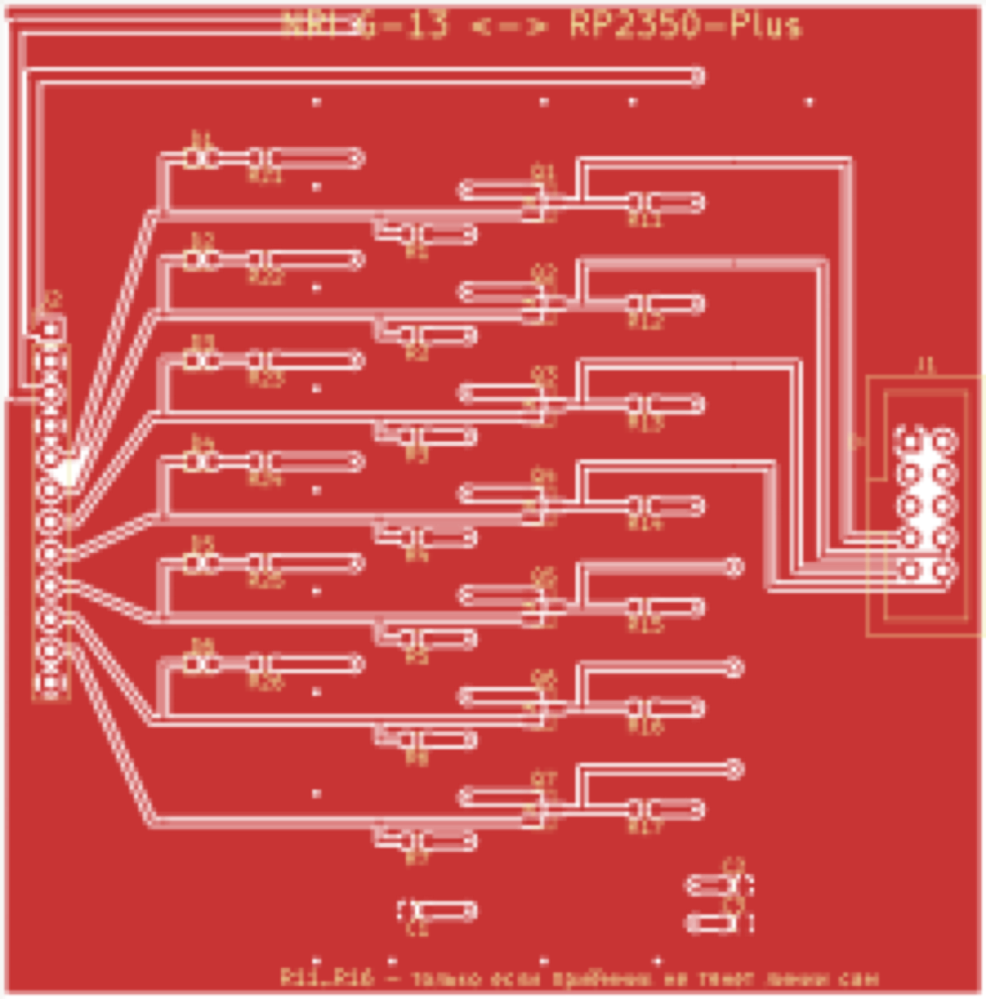
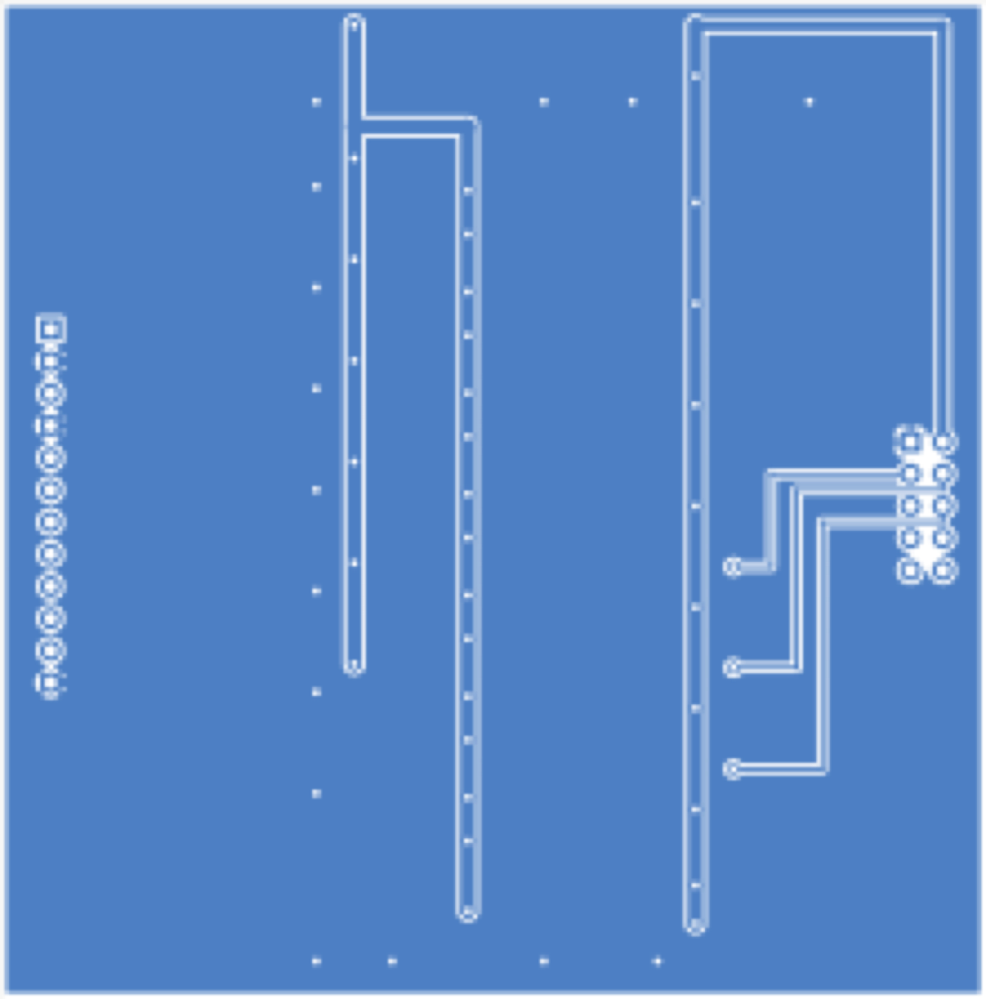

# Переходник NRI G-13 ↔ RP2350-Plus

Плата согласования уровней между монетоприёмником NRI G-13 (12 В) и платой
RP2350-Plus (3.3 В). Шесть линий монет и линия полной блокировки.



Открывать: `nri-g13-shifter.kicad_pro`. Для просмотра без KiCad —
[nri-g13-shifter.pdf](nri-g13-shifter.pdf).

## Зачем она нужна

Линии приёмника **двунаправленные**: по одной и той же линии приходит импульс
об опознанной монете и задаётся блокировка канала — удержанием линии в нуле.
Напрямую с выводом RP2350 их соединять нельзя:

| | из даташита `G-13.6000-1 d`, стр. 22 |
|---|---|
| блокировка канала | `≤ 1 В` |
| приём канала | `≥ 3,5 В` |
| допустимо на линии | до 35 В, до 150 мА |

Порог приёма **3,5 В выше, чем выдаёт плата**. Отсюда двунаправленный
преобразователь на BSS138 — по одному на линию: затвор на 3.3 В, исток к
плате, сток к приёмнику. Ровно так сделано в предыдущем поколении устройства
(`bahilizator_svn/hardware/main_baord/coin.sch`, `Q10…Q15`).

## Разъёмы

**J1** — к приёмнику, 10 контактов. Нумерация контактов и линий **не
совпадает**, это не опечатка:

| Контакт | Сигнал | Цепь |
|---|---|---|
| 1 | GND | `GND` |
| 2 | UB +12 В | `+12V` |
| 3 | output line 5 | `LINE5` |
| 4 | output line 6 | `LINE6` |
| 5 | return | не подключён |
| 6 | total blocking | `INHIBIT` |
| 7 | output line 1 | `LINE1` |
| 8 | output line 2 | `LINE2` |
| 9 | output line 3 | `LINE3` |
| 10 | output line 4 | `LINE4` |

Контакт 5 не подключаем: он нужен только варианту Casino, где по нему идёт
сигнал датчика приёма.

**J2** — единственный разъём к остальному устройству, 12 контактов. Питание
приёмника идёт через него же: отдельный клеммник означал бы второй кабель к
устройству, которое и так стоит в тесном корпусе.

| Контакт | Цепь | Куда |
|---|---|---|
| 1 | `+12V` | внешний источник 10–16 В, ~20 мА |
| 2 | `GND` | общая земля |
| 3 | `+3V3` | с платы RP2350-Plus |
| 4 | `GND` | |
| 5…11 | `GP3`…`GP9` | линии 1…6 и блокировка |
| 12 | `GND` | |

12 В на плату RP2350-Plus, разумеется, не подаётся — этот контакт идёт мимо
неё, прямо к источнику.

## Что и зачем стоит

| Позиции | Что | Зачем |
|---|---|---|
| Q1…Q7 | BSS138 | двунаправленное согласование 3.3 В ↔ 12 В |
| R1…R7 | 10 кОм к 3.3 В | подтяжка со стороны платы |
| R17 | 10 кОм к 12 В | **обязателен**: без него на входе блокировки не наберётся 3,5 В |
| R11…R16 | 10 кОм к 12 В | по месту, см. ниже |
| D1…D6 + R21…R26 | светодиод и 1 кОм | индикация импульса монеты |
| C1…C3 | 100n, 100n, 10µ | развязка по питанию |

### R11…R16 ставить не спешите

Линии монет — открытый коллектор, и подтягивать их должен кто-то один.
Приёмник обычно делает это сам. Измерьте линию относительно земли на
запитанном приёмнике, ничего к ней не подключая:

* **есть напряжение** — приёмник тянет сам, эти резисторы не нужны;
* **ноль или болтается** — поставьте.

Поэтому в схеме они помечены как неустанавливаемые (в KiCad — крестом).

### R7 держит автомат закрытым, пока контроллер в сбросе

`R7` подтягивает `GP9` к 3.3 В. Каскад не инвертирует: высокий уровень на
`GP9` → полевик закрыт → `R17` тянет линию к 12 В → **блокировка**.

Пока контроллер в сбросе, вывод не управляется, и без этого резистора линия
ушла бы к нулю — мёртвый автомат принимал бы монеты, не давая кредита. С ним
неуправляемое состояние совпадает с безопасным.

В прошивке этому соответствует `COIN_TOTAL_BLOCK_INVERTED = false`.

### Светодиода на GP9 нет намеренно

Он с резистором перетянул бы подтяжку `R7` и сломал бы ровно то свойство, ради
которого она стоит.

## Индикаторы отвечают на открытый вопрос

Светодиод горит, пока линия притянута к нулю, то есть весь импульс монеты
(100 мс). Этого хватает, чтобы **без прошивки** понять, как приёмник сообщает
о монете:

* мигнул **один** светодиод — одна монета на линию;
* мигнули **два** — двоичный код.

Это тот самый вопрос, который сейчас не решён: в `config::COINS` лежат оба
варианта, и первая же брошенная монета покажет, какой из них ваш.

## Плата

| верх | низ |
|---|---|
|  |  |

Два слоя, **78 × 79 мм**, земля залита с обеих сторон.

| | ширина |
|---|---|
| магистральные шины 3.3 В и 12 В | 1.2 мм |
| отводы питания | 0.8 мм |
| сигналы | 0.3 мм |

Ток тут копеечный — приёмник берёт около 20 мА, — так что ширина питания взята
не по нагреву, а ради надёжности: такую дорожку труднее подорвать при монтаже и
переделках.

Строка канала сжата до 8 мм за счёт того, что полосы внутри неё не
перекрываются по горизонтали: индикатор и отвод к разъёму делят одну высоту,
просто живут на разных участках платы.

Разводка ортогональная, и это не украшательство, а то, что позволило её
сгенерировать:

* **верх** — сигналы, горизонтальными строками, по строке на канал;
* **низ** — питание, вертикальными шинами, пересекающими все строки.

Пересечься они не могут по построению, а семь строк отличаются только
координатой `y`.

Две тонкости, которые пришлось развести руками:

* **Отвод к разъёму обходит R11…R17 сверху.** В линию его не поставить — там
  уже сидит сток полевика, и дорожка к разъёму упёрлась бы в резистор.
* **Разбор разъёма приёмника идёт по двум слоям.** Порядок контактов там свой
  и в строки ложится с перехлёстом; половина линий уходит вниз, и внутри
  каждой половины порядок уже монотонный, то есть пересечений нет.

Разбор гребёнки платы, наоборот, однослойный: её выводы и строки идут в одном
порядке, и веер получается непересекающимся сам собой.

### Про заливку

Земля залита по обоим слоям, и обе заливки получились сплошными: сигналы
живут наверху горизонтальными полосами, питание внизу вертикальными, и ни то,
ни другое не режет плату поперёк.

Дорожки земли под заливкой оставлены намеренно. Заливка на плотной плате может
разорваться на куски, и надеяться, что все они окажутся связаны, нельзя, —
а дорожка связывает гарантированно.

Сшивающие отверстия стоят **строго на этих дорожках**, а не в чистом поле:
отверстие, висящее в заливке, связью не считается ни для проверки, ни на
плате, если медь вокруг него окажется отрезанной. Это, кстати, единственная
ошибка, которую KiCad поймал в заливке: тринадцать отверстий по нижнему краю
оказались висящими, и их пришлось переставить.

## На производство

```bash
./make_gerbers.sh
```

Кладёт в `gerber/` полный комплект и собирает `nri-g13-shifter-gerber.zip` —
его и загружать на завод.

| Параметр | Значение |
|---|---|
| Слоёв | 2 |
| Размер | 78 × 79 мм |
| Толщина | 1.6 мм |
| Минимальная дорожка | 0.3 мм |
| Минимальный зазор | 0.2 мм |
| Отверстия | 0.6 мм (переходные, 50 шт) и 1.0 мм (разъёмы, 22 шт) |
| Поясок переходного | 0.2 мм |

Ничего дефицитного тут нет: дешёвые заводы держат 0.127 мм по дорожке и
0.2 мм по отверстию, то есть запас двукратный и больше.

Отчёт по сверловке — заодно проверка замысла: 50 отверстий по 0.6 мм это ровно
переходные, 22 по 1.0 мм — контакты двух разъёмов. Несовпадение здесь означало
бы, что на плате есть что-то, чего в разводке не задумывалось.

**`--check-zones` в скрипте обязателен.** Заливку заполняет KiCad, а не
`gen_pcb.py`, и без этого флага на завод уехала бы плата с пустыми зонами —
то есть без земли.

## Монтаж на заводе

`make_gerbers.sh` кладёт в `assembly/` то, без чего на монтаж не примут:

| Файл | Что это |
|---|---|
| `bom.csv` | перечень элементов с артикулами склада |
| `cpl.csv` | координаты и поворот каждого элемента |

`--exclude-dnp` стоит в обоих вызовах: `R11…R16` ставить не нужно, и завод не
должен узнавать об этом из примечания в письме.

### Порядок заказа на JLCPCB

1. **Плата.** На главной «Order now», загрузить `nri-g13-shifter-gerber.zip`.
   Размер и число слоёв подхватятся сами: 78 × 79 мм, два слоя. Из настроек
   менять нечего — толщина 1.6 мм и покрытие HASL идут по умолчанию.
   Минимальный тираж плат — 5 штук.

2. **Включить монтаж.** Переключатель `PCB Assembly`. Сторона — только
   верхняя, все элементы там. Количество собираемых плат можно взять меньше,
   чем плат: собрать две, а три оставить про запас, выйдет заметно дешевле.

3. **Загрузить файлы.** `assembly/bom.csv` в поле BOM, `assembly/cpl.csv` в
   поле CPL. Разъёмы в них исключены намеренно — см. ниже.

   Оба файла уже приведены к тому виду, который завод принимает: обозначения
   перечислены поштучно, а не диапазонами вида `D1-D6`, и шапка координат
   названа так, как ждёт JLCPCB — `Designator, Mid X, Mid Y, Rotation, Layer`.
   KiCad по умолчанию делает и то, и другое по-своему, а завод на этом
   спотыкается молча: `File processing failed` без единой подробности.

4. **Сверить детали.** Шесть строк должны опознаться по артикулам без ручного
   подбора. Проверить наличие на складе: артикулы верные, но остатки живут
   своей жизнью.

5. **Сверить установку — не пропускать этот шаг.** Показывают плату с
   расставленными деталями. Смотреть надо на светодиоды и BSS138: соглашение о
   нуле поворота у KiCad и у завода совпадает не всегда. Для светодиода
   ошибка означает обратную полярность, то есть шесть неработающих
   индикаторов.

6. Корзина, доставка, оплата.

Разъёмы `J1` и `J2` придётся припаять самому: выводной монтаж у JLCPCB —
отдельная услуга, а двадцать два вывода паяются руками за десять минут.
Купить их проще локально, чем ждать в той же посылке.

Из чего складывается цена: сами платы, разовая настройка станка, разовая плата
за расширенную позицию (`BSS138`), стоимость деталей и доставка. Точные суммы
показывает корзина — на глаз это десятки долларов, а не сотни, но верить надо
корзине, а не мне.

### Артикулы JLCPCB

Проставлены в схеме, при компонентах, и оттуда попадают и в `bom.csv`, и в
плату. Все сверены по каталогу, а не восстановлены по памяти: неверный код —
это не опечатка, а другая деталь на плате.

| Позиция | Артикул | Что это | Набор |
|---|---|---|---|
| R1…R7, R17 | `C25804` | 10 кОм 0603 1% | базовый |
| R21…R26 | `C23179` | 470 Ом 0603 1% | базовый |
| C1, C2 | `C14663` | 100 нФ 50 В 0603 X7R | базовый |
| C3 | `C15849` | 1 мкФ 50 В 0603 | базовый |
| D1…D6 | `C2286` | светодиод красный 0603 | базовый |
| Q1…Q7 | `C78284` | BSS138 SOT-23, порог 0.8 В | расширенный |

За расширенную позицию берут разовую плату за настройку станка. Менять BSS138
на базовый 2N7002 (`C8545`) не стоит: у того порог отпирания вдвое выше, а весь
смысл каскада в том, чтобы он открывался от 3.3 В.

**Светодиод именно красный.** Зелёный в корпусе 0603 имеет прямое напряжение
3.3 В — ровно столько, сколько на шине, — и от неё попросту не зажёгся бы.
У красного 1.8…2.4 В, и через 470 Ом получается около 3 мА: для вспышки длиной
100 мс этого хватает уверенно.

Артикулы стоит перепроверить на наличие в момент заказа — склад живёт своей
жизнью.

### Два номинала исправлены при подборе артикулов

Оба раза ошибка была не в схеме, а в том, чего в схеме не написано.

**`C3`: было 10 мкФ, стало 1 мкФ.** В корпусе 0603 десять микрофарад бывают
только на 10 вольт, а `C3` сидит на шине 12 В — номинал был просто
неработоспособен. В схеме написано «10u», рабочего напряжения там нет, а в
каталоге есть.

**`R21…R26`: было 1 кОм, стало 470 Ом.** Заодно сменился цвет светодиода, и по
той же причине: у зелёного прямое напряжение равно напряжению шины.

### Две вещи, которые придётся сделать руками

**Повороты.** Соглашение о нуле поворота у KiCad и у заводов совпадает не
всегда — чаще всего расходятся как раз светодиоды и SOT-23. В просмотрщике
заказа видно, куда смотрит первый вывод; сверьтесь по нему, прежде чем платить.
Для светодиода это ещё и полярность.

**Разъёмы.** `J1` и `J2` — выводной монтаж, у большинства заводов это отдельная
услуга, дороже поверхностного. Двадцать два вывода паяются руками за десять
минут, так что дешевле исключить их из заказа и поставить самому.

## Как пересобрать

Схема генерируется скриптом: семь каналов отличаются только именами цепей, и
копировать их мышью — верный способ ошибиться в одном из семи.

```bash
python3 gen_sch.py                                    # схема + bom.md
kicad-cli sch erc nri-g13-shifter.kicad_sch
kicad-cli sch export netlist --format kicadsexpr -o net.txt nri-g13-shifter.kicad_sch
python3 gen_pcb.py                                    # плата
kicad-cli pcb drc --refill-zones --save-board --schematic-parity nri-g13-shifter.kicad_pcb
```

`gen_pcb.py` берёт цепи, номиналы и посадочные места **из нетлиста схемы**, а
не задаёт их заново: разойтись со схемой они не могут в принципе.

`--refill-zones --save-board` обязателен: скрипт описывает контур заливки, а
заполняет её KiCad. Без этого шага плата откроется с пустыми зонами.

Определения символов скрипт берёт из установленных библиотек KiCad и встраивает
в файл целиком: распиновка BSS138 и разъёмов настоящая, а схема при этом
открывается на машине без этих библиотек.

## Состояние

Проверено средствами KiCad 10:

| Проверка | Результат |
|---|---|
| ERC схемы | 0 нарушений |
| DRC платы | 0 нарушений |
| Неразведённые связи | 0 |
| Сверка платы со схемой | 0 расхождений |

Нетлист вдобавок сверен с замыслом по каждому контакту вручную.

**Плата не изготавливалась и не собиралась.** Всё сказанное — про файлы,
а не про железо.
